# PortaBrasil 系统模块流程图

> 基于项目源代码绘制，简化版。

---

## 1. 登录认证模块

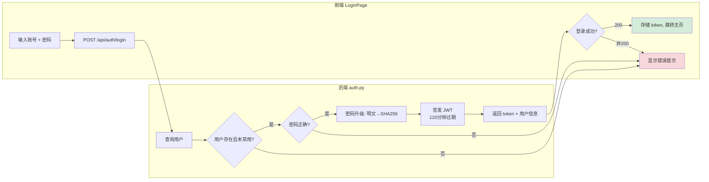

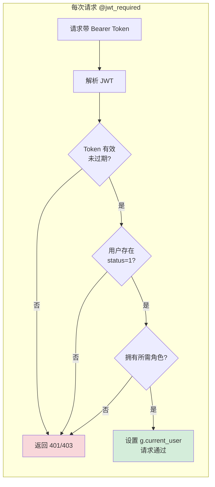

---

## 2. 资料上传模块

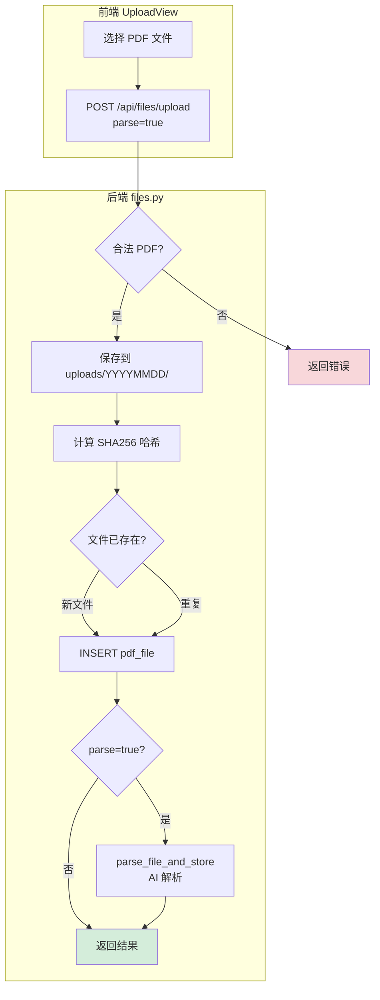

---

## 3. 单据解析模块

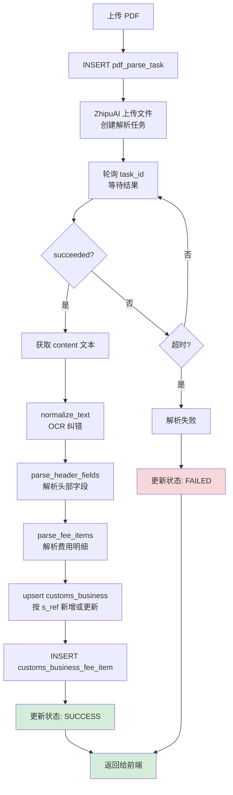

---

## 4. 审计校验模块

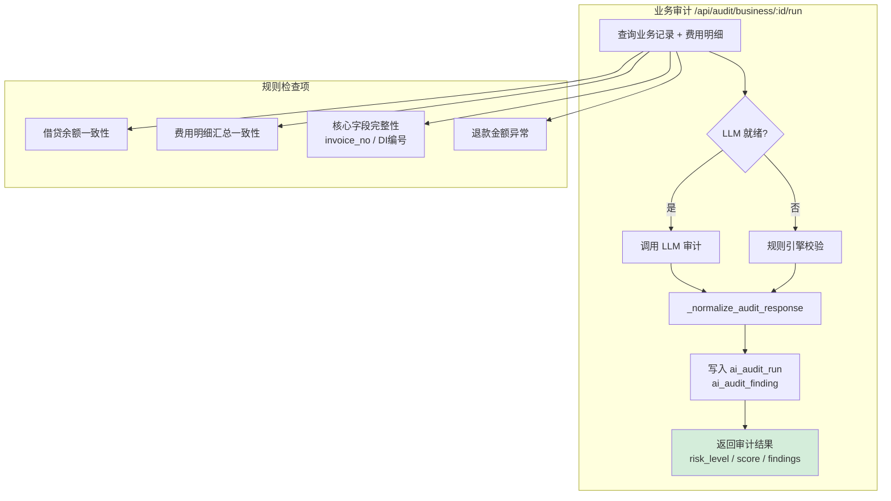

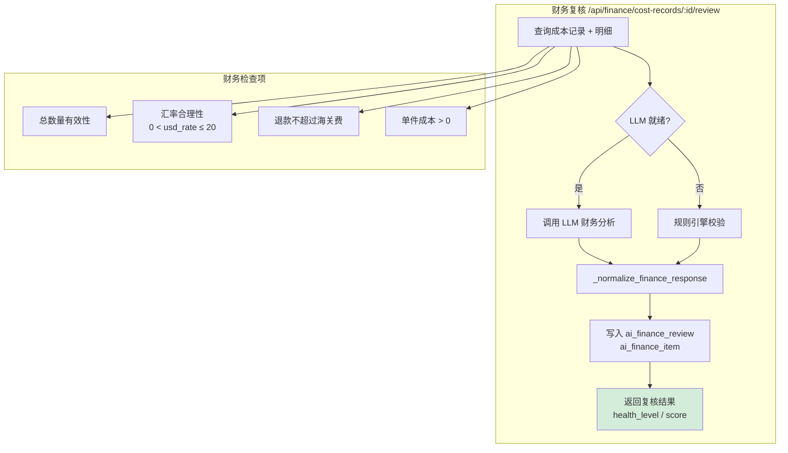

---

## 5. 费用核算模块

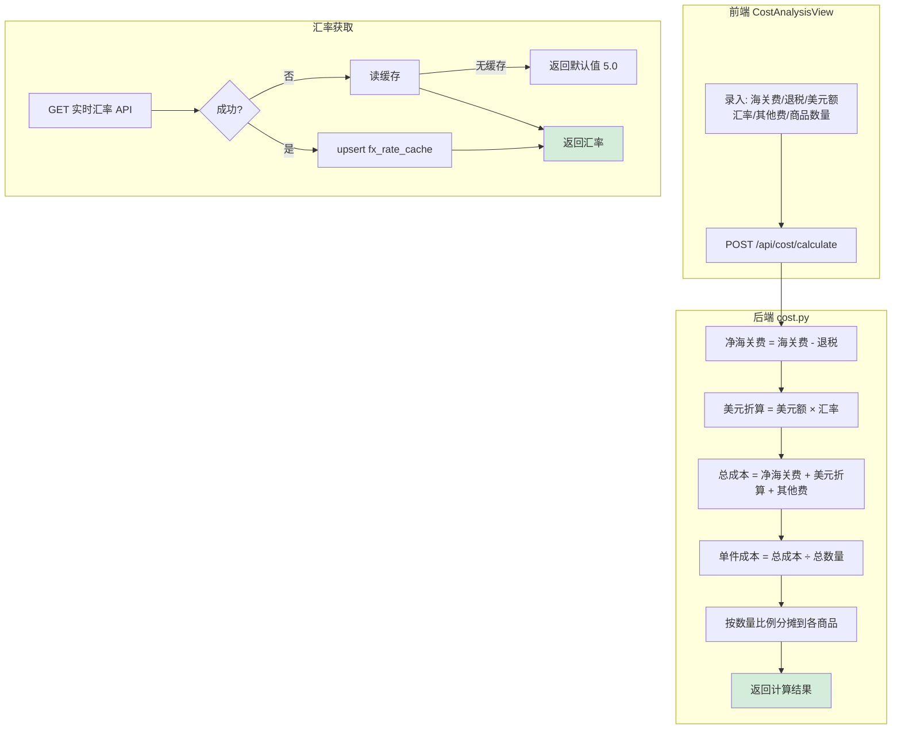

---

## 6. 流程流转模块

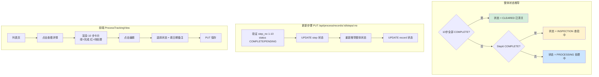

---

## 7. 任务管理模块

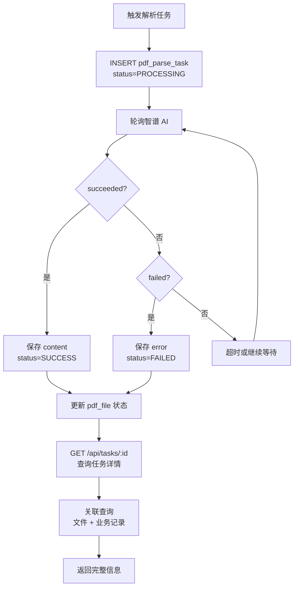

---

## 8. 统计分析模块

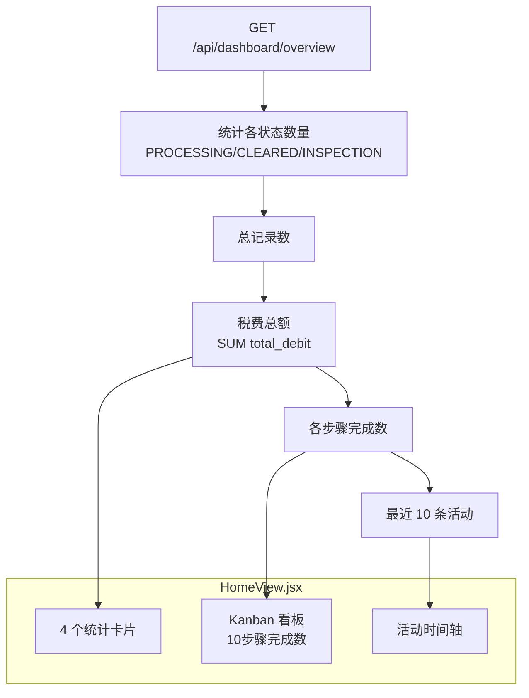

---

## 9. 系统管理模块

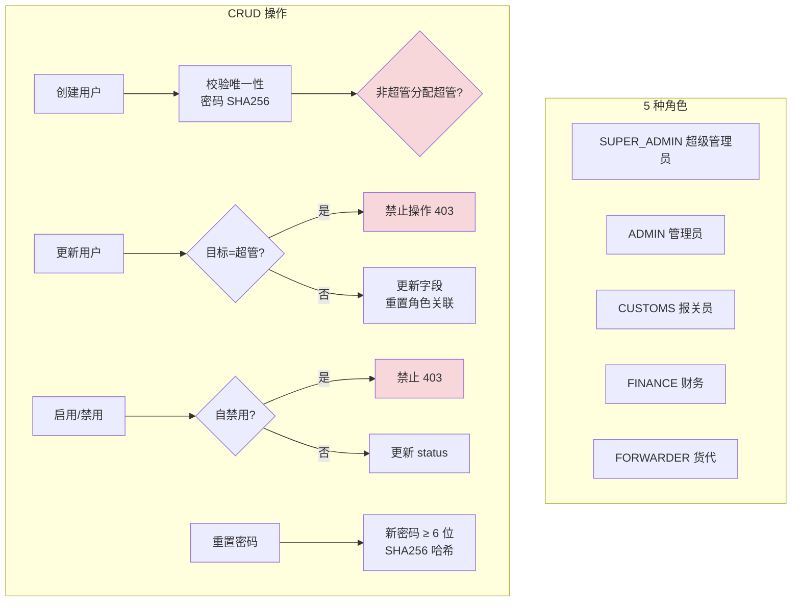

---

*以上流程图基于 PortaBrasil 项目源代码绘制。*
